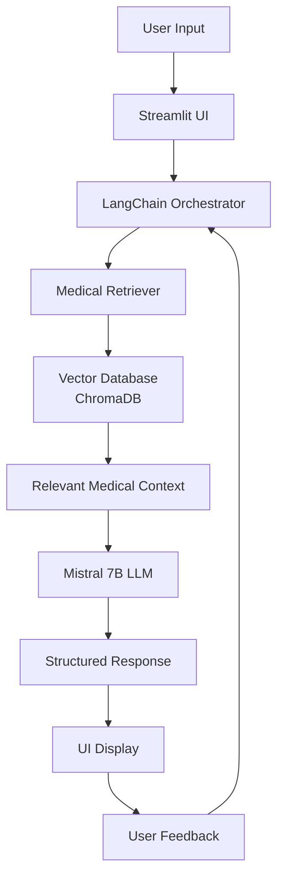

Hippocrates AI: Clinical Decision Support System 🩺

[](https://your-username-hippocrates-ai.hf.space)


> **⚠️ IMPORTANT DISCLAIMER:** This is an **educational proof-of-concept** project. It is **NOT** for clinical use, **NOT** a medical device, and **NOT** a substitute for professional medical advice. Always consult qualified healthcare professionals for medical decisions.

 📋 Table of Contents
- [Overview](#overview)
- [Features](#features)
- [Demo](#demo)
- [Installation](#installation)
- [Usage](#usage)
- [Tech Stack](#tech-stack)
- [Project Structure](#project-structure)
- [How It Works](#how-it-works)
- [Development Process](#development-process)
- [Future Improvements](#future-improvements)
- [Contributing](#contributing)
- [License](#license)
- [Acknowledgements](#acknowledgements)

 🎯 Overview

Hippocrates AI** is an intelligent, conversational AI assistant designed to demonstrate how artificial intelligence can support clinical reasoning for upper respiratory infections. Built as a proof-of-concept, it showcases the potential of modern AI technologies in healthcare while emphasizing safety, explainability, and human oversight.

Key Principles:
- 🤖 AI-Assisted, Not AI-Replaced: The physician remains the ultimate decision-maker
- 📚 Evidence-Based: All suggestions are grounded in medical literature
- 🔍 **Explainable AI**: Every recommendation comes with reasoning and sources
- 🛡️ **Safety-First**: Includes red flag warnings and confidence scoring

✨ Features

 Core Capabilities
- Conversational Diagnostic Interview**: Natural language dialogue to gather patient information
- Differential Diagnosis Generation**: Ranked list of possible conditions with confidence scores
- Evidence-Based Reasoning**: Citations from reputable medical sources
- Smart Follow-up Questions**: Context-aware questioning to refine diagnosis
- Structured Output**: Clear presentation of diagnoses, evidence, and next steps

User Interface
- 🎨 Professional Medical UI: Clean, intuitive interface designed for clinical workflow
- 💬 Real-time Chat: Smooth conversation flow with typing indicators
- 📊 Visual Confidence Display: Color-coded confidence levels (High/Medium/Low)
- 📁 Case Management: Save and review previous consultations
- 📄 Export Functionality: Generate PDF reports of the diagnostic session

🎥 Demo

Live Demo (Limited Version)
Visit our hosted demo: [Hippocrates AI on Hugging Face](https://your-username-hippocrates-ai.hf.space)

 Video Demonstration
[](https://youtu.be/YOUR_VIDEO_ID)

 Sample Interaction
```
Doctor: 35-year-old male with sore throat, fever, and swollen lymph nodes
AI: How long have these symptoms been present? Any cough or runny nose?
Doctor: 2 days, no cough
AI: What's the temperature? Any difficulty swallowing?
Doctor: 101.5°F, mild difficulty
AI: Based on the information:
    1. Strep Pharyngitis (High Confidence)
       - Evidence: Rapid onset, fever >101°F, no cough, swollen lymph nodes
       - Next: Rapid strep test, throat culture
       - Red Flags: Difficulty breathing, inability to swallow saliva
```

 🚀 Installation

Prerequisites
- Python 3.10 or higher
- At least 8GB RAM (16GB recommended for optimal performance)
- Git installed on your system
- Ollama (for running local LLM)

 Step-by-Step Setup

 1. Clone the Repository
```bash
git clone https://github.com/your-username/hippocrates-ai.git
cd hippocrates-ai
```

 2. Install Ollama
- **Windows**: Download from [ollama.ai](https://ollama.ai/download)
- **Mac/Linux**:
  ```bash
  curl -fsSL https://ollama.ai/install.sh | sh
  ```

3. Download the Medical Model
```bash
ollama pull mistral  # Or: ollama pull llama2
```

 4. Set Up Python Environment
```bash
# Create virtual environment
python -m venv venv

# Activate it
# On Windows:
venv\Scripts\activate
# On Mac/Linux:
source venv/bin/activate

# Install dependencies
pip install -r requirements.txt
```

 5. Initialize the Knowledge Base
```bash
# This creates the vector database from medical sources
python src/setup_knowledge_base.py
```
 6. Run the Application
```bash
# Start the Ollama server (in a separate terminal)
ollama serve

# In your main terminal, run the Streamlit app
streamlit run src/main.py
```

The application will open in your browser at `http://localhost:8501`

 📖 Usage

Starting a New Consultation
1. Click **"New Consultation"** button
2. Enter initial patient information:
   - Age and gender
   - Chief complaint
   - Any known medical history or medications

Conducting the Diagnostic Interview
3. The AI will ask follow-up questions one at a time
4. Answer questions naturally (like talking to a colleague)
5. Use quick-reply buttons when available for faster interaction

 Reviewing Results
6. View the **ranked differential diagnosis**
7. Click on any condition to see:
   - Confidence level and supporting evidence
   - Recommended tests and procedures
   - Red flag warnings if present
 Exporting Results
8. Click "Export Report" to save as PDF
9. Use "Save Case" to store in local database for review

 🛠️ Tech Stack
Core Technologies
| Component | Technology | Version | Purpose |
|-----------|------------|---------|---------|
| Language| Python | 3.10+ | Backend logic and AI processing |
| UI Framework | Streamlit | 1.25+ | Interactive web interface |
| LLM Framework | LangChain | 0.0.350+ | AI orchestration and chain building |
| Local LLM| Mistral 7B via Ollama | Latest | Open-source language model |
| Vector Database | ChromaDB | 0.4.15+ | Medical knowledge retrieval |
| Embeddings | all-MiniLM-L6-v2 | - | Text vectorization |
| API Framework | FastAPI | 0.104+ | Optional backend server |

 Key Libraries
- Medical NLP: `spaCy`, `medspacy` (for clinical text processing)
- Data Processing: `pandas`, `numpy`
- PDF Generation: `reportlab`, `fpdf`
-Caching: `redis` (optional, for production)
- Testing: `pytest`, `unittest`

Development Tools
- Version Control: Git + GitHub
- Code Quality: `black`, `flake8`, `mypy`
- Containerization: Docker + Docker Compose
- CI/CD: GitHub Actions (for automated testing)
- Documentation: MkDocs + GitHub Pages

📁 Project Structure

```
hippocrates-ai/
├── data/                           # Medical knowledge base
│   ├── raw/                        # Original medical texts
│   ├── processed/                  # Cleaned and structured data
│   └── vector_db/                  # ChromaDB vector stores
├── src/                            # Source code
│   ├── main.py                     # Streamlit application entry point
│   ├── chat_engine/                # Core conversation logic
│   │   ├── chain_builder.py        # LangChain configuration
│   │   ├── prompt_templates.py     # System prompts and templates
│   │   └── memory_manager.py       # Conversation state handling
│   ├── knowledge_base/             # Medical knowledge processing
│   │   ├── data_loader.py          # Load medical sources
│   │   ├── vectorizer.py           # Create embeddings
│   │   └── retriever.py            # Semantic search
│   ├── ui/                         # User interface components
│   │   ├── components/             # Reusable UI widgets
│   │   ├── themes/                 # CSS and styling
│   │   └── utils.py                # UI helper functions
│   └── utils/                      # General utilities
│       ├── config.py               # Configuration management
│       ├── logger.py               # Logging setup
│       └── validators.py           # Input validation
├── tests/                          # Test suite
│   ├── unit/                       # Unit tests
│   ├── integration/                # Integration tests
│   └── fixtures/                   # Test data
├── docs/                           # Documentation
│   ├── api/                        # API documentation
│   ├── user_guide/                 # User manual
│   └── developer_guide/            # Contributor guide
├── docker/                         # Containerization files
│   ├── Dockerfile
│   └── docker-compose.yml
├── .github/                        # GitHub workflows
│   └── workflows/
│       └── ci-cd.yml
├── requirements.txt                # Python dependencies
├── requirements-dev.txt            # Development dependencies
├── pyproject.toml                  # Project configuration
├── mkdocs.yml                      # Documentation config
└── README.md                       # This file
```

🧠 How It Works

Architecture Overview



The RAG Pipeline (Retrieval-Augmented Generation)

1. Medical Knowledge Ingestion
   - Curated medical texts from trusted sources (Merck Manual, PubMed Central)
   - Processed into chunks with metadata (source, condition, symptom)
   - Embedded using medical-domain optimized models

2. Intelligent Retrieval
   - Semantic search for relevant medical information
   - Context ranking based on clinical relevance
   - Source attribution for every retrieved chunk

3. Context-Aware Generation
   - Medical context injected into LLM prompts
   - Structured output enforcement (JSON schema validation)
   - Confidence scoring based on evidence strength

### Conversation Management
- Context Window: Maintains conversation history (last 10 exchanges)
- State Tracking: Tracks gathered symptoms, ruled-out conditions
- Question Strategy: Adaptive questioning based on Bayesian probability

  Development Process

 Phase 1: Research & Design (Week 1-2)
- Literature review of diagnostic errors and AI in medicine
- User interviews with medical students and residents
- System architecture design and technology selection
- Creation of comprehensive test cases

Phase 2: Core Development (Week 3-6)
- Medical knowledge base creation and validation
- Implementation of RAG pipeline
- Conversation engine development
- Basic UI implementation

Phase 3: Refinement (Week 7-8)
- Prompt engineering and fine-tuning
- Confidence scoring algorithm development
- UI/UX polish and usability testing
- Performance optimization

Phase 4: Testing & Documentation (Week 9-10)
- Comprehensive testing (unit, integration, user acceptance)
- Documentation creation
- Deployment pipeline setup
- Demo video production

🔮 Future Improvements

 Short-Term Goals
- [ ] Add support for more medical domains (cardiology, gastroenterology)
- [ ] Implement multi-language support
- [ ] Add voice input/output capabilities
- [ ] Create mobile app version

Medium-Term Goals
- [ ] Integration with medical education platforms
- [ ] Real-time medical literature updates via PubMed API
- [ ] Advanced visualization of diagnostic reasoning
- [ ] Collaborative features for team consultations

 Long-Term Vision
- [ ] Multi-modal input (images, lab reports, ECGs)
- [ ] Integration with electronic health record systems
- [ ] Federated learning for privacy-preserving improvements
- [ ] Clinical trial validation studies

🤝 Contributing

We welcome contributions from students, developers, and medical professionals!

How to Contribute
1. Fork the repositor
2.Create a feature branch
   ```bash
   git checkout -b feature/amazing-feature
   ```
3. Make your changes
4. Run tests
   ```bash
   pytest
   ```
5. Commit your changes
   ```bash
   git commit -m 'Add amazing feature'
   ```
6. Push to the branch
   ```bash
   git push origin feature/amazing-feature
   ```
7. Open a Pull Request

 Contribution Areas
- Medical Knowledge: Help expand and validate the knowledge base
- UI/UX: Improve the interface for clinical workflows
- AI/ML: Enhance the diagnostic algorithms
- Documentation: Improve guides and tutorials
- Testing: Add more test cases and validation

Code Standards
- Follow PEP 8 style guide
- Write comprehensive docstrings
- Add unit tests for new functionality
- Update documentation with changes


🙏 Acknowledgements

 Medical Resources
- Merck Manual Professional Version for medical content
- PubMed Central for research articles
- CDC Guidelines for infectious disease protocols

Technical Resources
- Ollama team for making local LLMs accessible
- LangChain community for excellent documentation
- Streamlit for simplifying web app development

Inspiration
- Medical professionals working to reduce diagnostic errors
- Open-source healthcare AI projects pushing boundaries
- Educators integrating technology into medical training

Special Thanks
- Medical students who provided workflow insights
- Open-source contributors to healthcare AI projects
- AI research community advancing clinical applications

 📞 Contact & Support

Project Maintainer: nishant kumar 
+91 8468002278

For Medical Professionals: We welcome feedback on clinical accuracy and workflow integration.

For Developers: Check our [GitHub Issues](https://github.com/yourusername/hippocrates-ai/issues) for known issues and feature requests.


---

<div align="center">
  
**Made with ❤️ for the future of healthcare**

*"The art of medicine consists of amusing the patient while nature cures the disease."* — Voltaire

</div>
```

 🚀 Quick Start Commands Cheat Sheet

```bash
# One-line setup (after prerequisites)
git clone https://github.com/your-username/hippocrates-ai.git && cd hippocrates-ai && python -m venv venv && source venv/bin/activate && pip install -r requirements.txt && ollama pull mistral && python src/setup_knowledge_base.py

# Start the application
ollama serve  # In terminal 1
streamlit run src/main.py  # In terminal 2

# Run tests
pytest tests/

# Build documentation
mkdocs build

# Run with Docker
docker-compose up
```

---

⭐ If you find this project useful, please consider giving it a star on GitHub!
